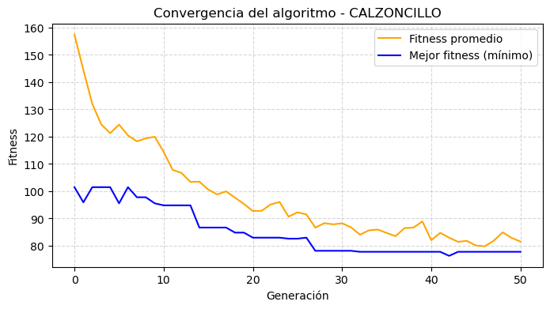
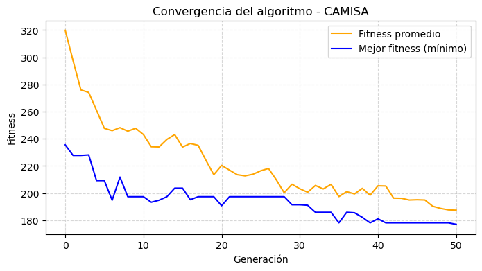
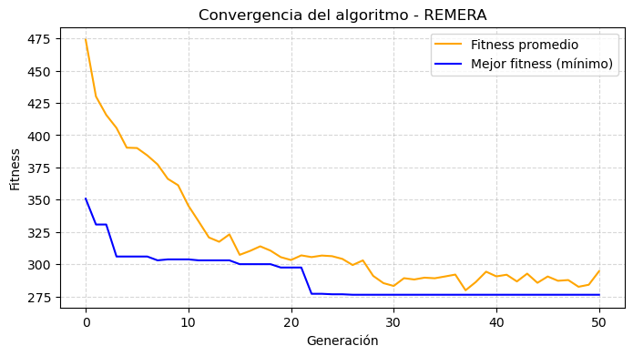
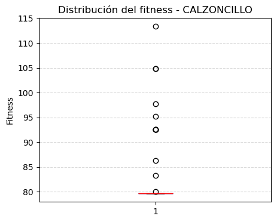
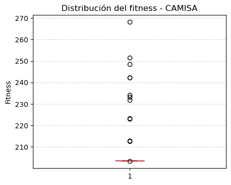
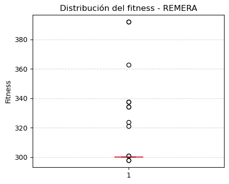
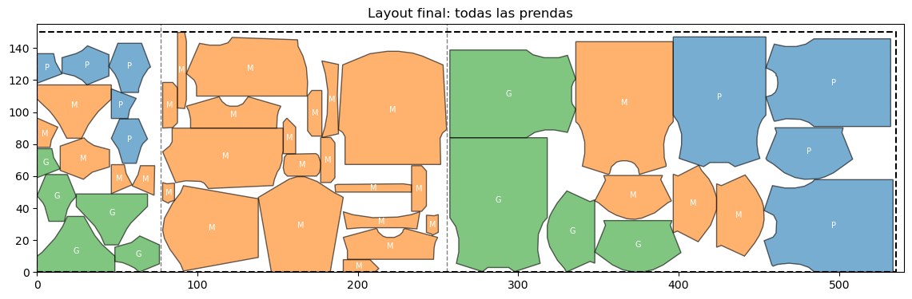

# Optimización evolutiva de disposición de moldes en una tela

**Alumno:** Kevin André Cajachuán Arroyo - A1606  
**Materia:** Algoritmos Evolutivos I (MIA - FIUBA)  
**Técnica aplicada:** Algoritmos Genéticos (GA)  
**Fecha:** 17/10/2025  
**Repositorio:** [https://github.com/Kajachuan/ae1](https://github.com/Kajachuan/ae1)

---

## 1. Descripción del problema

El objetivo del trabajo consiste en **optimizar la disposición de moldes textiles sobre una tela** para minimizar el **largo total utilizado**, simulando un proceso de corte eficiente.  
Cada molde corresponde a una pieza de una prenda y el conjunto de piezas debe disponerse dentro de una franja de altura fija, evitando solapamientos y respetando la geometría real de cada figura.

Este problema pertenece a la familia de los **problemas de empaquetado bidimensional (2D bin packing)**, los cuales son combinatorios y de naturaleza **NP-hard**, por lo que resultan adecuados para abordarse mediante algoritmos evolutivos.

---

## 2. Enfoque evolutivo utilizado

Se implementó un **Algoritmo Genético (GA)** utilizando la biblioteca **DEAP**, ampliamente empleada para prototipar modelos evolutivos.  
El algoritmo trabaja sobre una **población de individuos**, donde cada individuo representa una posible disposición de las piezas en la tela.  
El objetivo es minimizar el **largo total ocupado** por los moldes.

---

## 3. Función objetivo

La función de evaluación `evaluate()` calcula el **largo total utilizado** por el conjunto de moldes colocados secuencialmente en la franja de tela.  
Cada polígono se inserta uno a uno en la posición más a la izquierda posible sin solaparse con los anteriores.  

La métrica de fitness a minimizar es:

fitness = largo_usado + 0.001 * (1 - área_total / área_utilizada)

El segundo término penaliza configuraciones con bajo aprovechamiento del área.

---

## 4. Operadores genéticos

El algoritmo genético implementado se basa en la evolución de una población de soluciones posibles (individuos), donde cada individuo representa una forma válida de ubicar todos los moldes de una prenda dentro de una franja de tela.  
En cada generación se aplican operadores que permiten crear, recombinar y modificar individuos para explorar el espacio de búsqueda.

---

### 4.1. Generación de individuos (`init_individual`)

Cada individuo se representa como una lista de tuplas de la forma `(y, i, φ)`

donde:
- `i` es el índice del molde dentro de la lista `PIECES` (cada molde aparece una sola vez).
- `y` es la posición vertical dentro de la franja (en cm).
- `φ` es el ángulo de rotación de la pieza (0°, 90°, 180° o 270°).

El proceso de creación de un individuo es el siguiente:
1. Se toma una **permutación aleatoria** de los índices de las piezas, lo que determina el orden en que serán ubicadas horizontalmente.
2. Para cada pieza se calcula su altura (`h`) y se elige una posición vertical aleatoria `y` dentro del rango permitido `[0, STRIP_HEIGHT − h]`.
3. Se selecciona un ángulo de rotación `φ` aleatorio entre los valores predefinidos.

Esto garantiza que cada individuo inicial sea **válido** (sin piezas fuera del límite vertical) y que exista diversidad tanto en el orden como en la orientación de las piezas.

---

### 4.2. Cruzamiento (`cx_pmx_tuples`)

El cruzamiento combina la información de dos individuos (padres) para generar nuevos individuos (hijos).  
Se utiliza una adaptación del **Partially Matched Crossover (PMX)**, un operador clásico para permutaciones.

El procedimiento es:
1. Se extraen los índices `i` de las piezas en cada padre.
2. Se aplica PMX sobre esas secuencias de índices, produciendo nuevas permutaciones sin duplicados ni omisiones.
3. Para cada posición de la lista, se elige aleatoriamente el par `(y, φ)` de uno de los padres, combinándolo con el nuevo índice obtenido por el PMX.

Este operador asegura que:
- No se pierda ni se repita ninguna pieza.
- Se mantenga parte de la estructura del orden parental (subsecuencias exitosas).
- Se herede variación en posiciones y orientaciones.

En términos evolutivos, el PMX aporta **explotación**, ya que conserva relaciones entre moldes que ya resultaron eficientes, y **exploración**, al combinar diferentes órdenes parciales.

---

### 4.3. Mutación (`mut_tuples`)

La mutación introduce pequeñas alteraciones aleatorias en los individuos para evitar la convergencia prematura.

Se aplican dos posibles tipos de mutación:
1. Con probabilidad 0.3, se realiza un **intercambio (swap)** de dos tuplas completas, modificando el orden de colocación de las piezas.
2. En los demás casos, se elige un gen al azar y:
   - se modifica su coordenada `y` por un nuevo valor aleatorio dentro del rango permitido, o
   - se cambia el ángulo de rotación `φ`.

Este operador mantiene siempre la **validez geométrica** del individuo, ya que:
- las piezas nunca se colocan fuera del rango vertical,
- el orden sigue siendo una permutación válida,
- la variabilidad se conserva al cambiar posiciones o rotaciones.

El **swap** actúa a nivel de estructura (exploración global) y el cambio de `y` o `φ` actúa a nivel local (ajuste fino).

---

### 4.4. Selección (`selTournament`)

Para seleccionar los individuos que pasarán a la siguiente generación se utiliza la estrategia de **torneo de tamaño 3**.

El procedimiento consiste en:
1. Seleccionar tres individuos al azar de la población.
2. Evaluar sus valores de fitness.
3. Retener el mejor (menor fitness).

Este método equilibra **presión selectiva** y **diversidad poblacional**:
- Preserva soluciones de buena calidad.
- Evita la pérdida de variabilidad genética que produciría una selección demasiado agresiva.

---

### 4.5. Evaluación y elitismo

La función de evaluación calcula el **largo total usado** por la disposición de piezas y penaliza configuraciones con bajo aprovechamiento del área.  
El algoritmo incorpora además un mecanismo de **elitismo** (`HallOfFame(1)`), garantizando que el mejor individuo de cada generación **no se pierda** durante la reproducción.

---

## 5. Implementación general

El código se estructuró de forma modular:

- `cargar_moldes_desde_png()`: lee archivos de imagen `.png` y extrae los contornos vectoriales con **OpenCV** y **Shapely**.  
  Cada contorno se convierte en un polígono escalado a tamaño real (1 px = 1 cm). Como cada imagen tiene 432 píxeles de alto representando 160 cm reales, se aplicó como factor de escalado 160 / 432.

- `place_piece()` y `place_pieces()`: gestionan la ubicación de cada polígono en la tela, verificando solapamientos y aplicando desplazamientos horizontales y verticales según corresponda.

- `evaluate()`: calcula el largo total y la eficiencia de uso.

- `run_ga_for_prenda()`: ejecuta el GA para una prenda específica y retorna el mejor individuo y sus métricas de convergencia.

- `plot_convergence()` y `plot_boxplot()`: generan los gráficos de evolución y dispersión del fitness, requeridos por el desafío.

La estructura principal recorre las tres prendas del dataset (`calzoncillo`, `camisa`, `remera`) y aplica el proceso de optimización de forma independiente a cada una, concatenando luego los resultados sobre una misma “tela” virtual. Es importante destacar que los moldes de distintas prendas no deben mezclarse, ya que esto permite estimar de forma separada el consumo y costo de tela por prenda.
No obstante, dentro de una misma prenda, los moldes de distintos talles pueden combinarse, dado que pertenecen al mismo tipo de confección y comparten las mismas proporciones geométricas.

---

## 6. Parámetros y configuración

| Parámetro | Valor |
|------------|--------|
| Tamaño de población | 50 individuos |
| Número de generaciones | 50 |
| Probabilidad de cruzamiento | 0.7 |
| Probabilidad de mutación | 0.3 |
| Altura de la franja (STRIP_HEIGHT) | 150 cm |
| Rango de rotación permitido | {0°, 90°, 180°, 270°} |

Los parámetros fueron elegidos buscando un equilibrio entre **velocidad de convergencia y diversidad poblacional**.  
Se realizaron ajustes experimentales del tamaño de población y del número de generaciones para evitar estancamientos prematuros.

---

## 7. Dificultades encontradas y soluciones

1. **Carga y procesamiento de imágenes:**  
   Las imágenes de moldes presentaban diferencias en tamaño y orientación. Se implementó un escalado uniforme (`scale_factor = 160/432`) para que todas las piezas correspondan a medidas reales (1 px = 1 cm).

2. **Solapamientos entre moldes:**  
   Inicialmente se producían intersecciones entre piezas debido a traslaciones incorrectas.  
   Se resolvió mediante una búsqueda secuencial en `x`, verificando colisiones con `Shapely.overlaps()`.

3. **Dependencia de funciones dentro del bucle:**  
   Dado que cada prenda tiene moldes distintos, los operadores genéticos (`init_individual`, `cx_pmx_tuples`, `mut_tuples`) se definieron dentro del bucle principal, garantizando independencia entre ejecuciones.

4. **Visualización y validación:**  
   Se implementaron funciones de trazado (`plot_layout`) con codificación por color según talle (S, M, L, etc.), permitiendo validar visualmente la calidad de la disposición.

---

## 8. Resultados

### 8.1. Evaluación del desempeño del algoritmo

El algoritmo genético fue ejecutado para tres categorías de prendas: calzoncillo, camisa y remera, con una población de 50 individuos y un máximo de 50 generaciones por ejecución. El objetivo fue minimizar el largo total del rollo de tela, manteniendo una altura fija de 150 cm y permitiendo rotaciones de 0°, 90°, 180° y 270° por pieza.

En todas las ejecuciones, el algoritmo mostró una tendencia de convergencia estable, reduciendo progresivamente el valor del fitness (largo total usado) a medida que aumentaban las generaciones. Esto indica que la combinación de operadores genéticos logró equilibrar la exploración y explotación del espacio de búsqueda.

---

### 8.2. Análisis de los gráficos

#### a) Gráficos de convergencia

Los gráficos de convergencia muestran en el eje horizontal las generaciones y en el eje vertical el valor del fitness.
En todos los casos, la línea azul (mejor fitness) desciende rápidamente en las primeras generaciones y luego se estabiliza, señal de que el algoritmo encuentra configuraciones óptimas tempranas y las refina gradualmente.
La línea naranja (promedio poblacional) converge hacia valores cercanos al mejor individuo, lo que refleja una población homogénea y un proceso de aprendizaje colectivo dentro de la población.

En particular, la prenda remera presenta una convergencia más rápida debido a la menor cantidad de moldes (12 piezas), mientras que camisa, con 20 moldes y geometrías más irregulares, requiere más generaciones para estabilizar el fitness.

---

#### b) Diagramas de caja

Los diagramas de caja ilustran la distribución de valores de fitness en la última generación.
En los tres casos, se observa una disminución de la dispersión con respecto a generaciones anteriores, indicando que la población converge hacia soluciones similares.
Las medianas (líneas rojas) cercanas a los mínimos absolutos demuestran que la mayoría de los individuos alcanzan configuraciones eficientes, confirmando la robustez del proceso evolutivo y la baja presencia de valores atípicos.

---

#### c) Layout final

El layout final muestra la disposición óptima de todas las piezas en el rollo, diferenciadas por color según el talle (P, M, G).
Las líneas punteadas verticales dividen las secciones asignadas a cada tipo de prenda, manteniendo márgenes regulares y evitando superposiciones.
El largo total final alcanzado fue de 535.63 cm cm, lo que representa la longitud mínima necesaria para ubicar todas las prendas considerando las restricciones geométricas y de separación (1 cm entre prendas).

Visualmente, el diseño demuestra una buena compactación de moldes y una utilización eficiente del espacio, cumpliendo con el objetivo principal del trabajo.

---

## 9. Ejecución en Colab

El script fue diseñado para ejecutarse en **Google Colab** sin dependencias externas adicionales, utilizando solo bibliotecas disponibles por defecto en entornos científicos de Python (DEAP, Shapely, OpenCV, Matplotlib).

---

## 10. Conclusiones

El modelo implementado permite resolver de forma eficiente un problema de corte bidimensional mediante **Algoritmos Genéticos**, obteniendo configuraciones válidas y eficientes de moldes.  
El enfoque propuesto es fácilmente extensible a otros materiales o restricciones geométricas (rotaciones libres, agrupamiento por tipo de tejido, etc.).